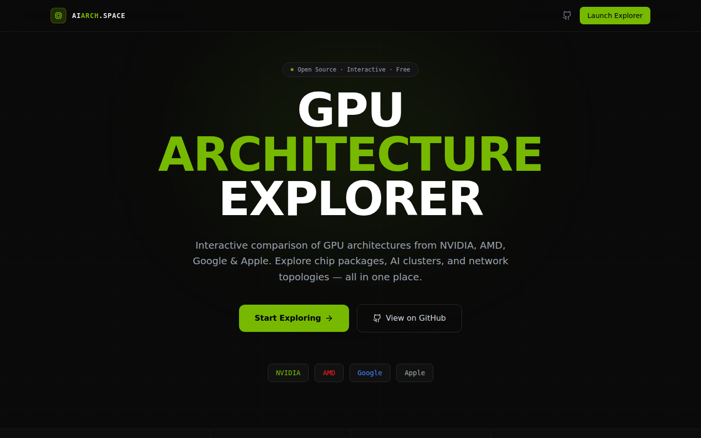
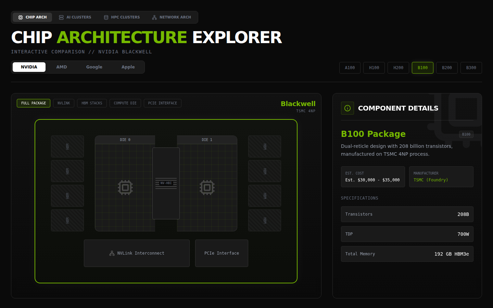
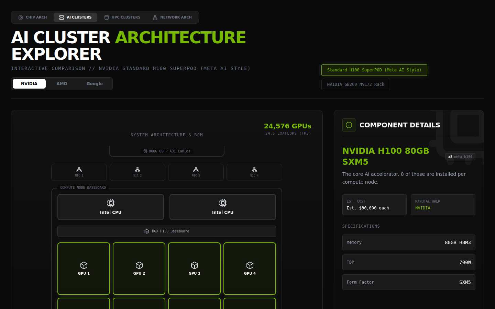
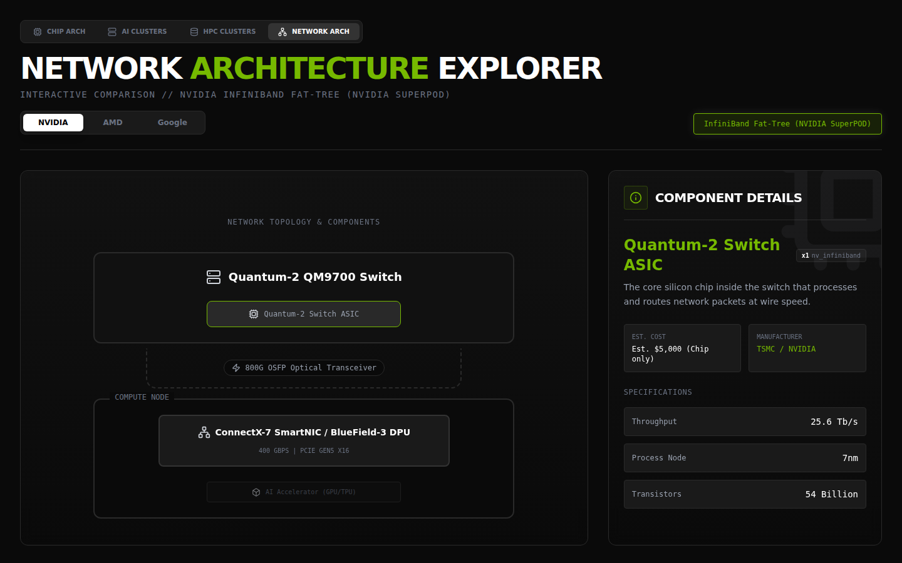

<div align="center">

# GPU Architecture Explorer

**Interactive comparison of GPU architectures from NVIDIA, AMD, Google, and Apple**

[Live Demo](https://aiarchitecture.space/) · [Report Bug](https://github.com/PantherLand/gpu-architecture-explorer/issues)

</div>

## Screenshots

### Landing Page



### Chip Architecture
Interactive GPU package diagrams — explore HBM stacks, compute dies, NVLink interconnects, and PCIe interfaces.



### AI Cluster Architecture
Visualize large-scale AI training clusters like Meta's H100 SuperPOD (24,576 GPUs) and NVIDIA GB200 NVL72 racks.



### Network Architecture
Understand network topologies — InfiniBand fat-tree, RoCEv2 Ethernet, and Optical Circuit Switches.



## Features

- **Multi-vendor comparison** — NVIDIA (A100 → H100 → H200 → B100 → B200 → B300), AMD (MI250X, MI300X, MI325X), Google TPU v5p, Apple M-series
- **Chip Architecture view** — Interactive package layout with HBM stacks, compute dies, NV-HBI bridges, and interconnects
- **AI / HPC Cluster view** — System-level BOM with CPUs, GPUs, NICs, switches, and cabling
- **Network Architecture view** — Fat-tree topologies with switch ASICs, optical transceivers, and SmartNICs
- **Component details panel** — Hover any component to see specs, estimated cost, and manufacturer info
- **Dark mode UI** with vendor-specific color accents

## Architectures Covered

| Vendor | Models |
|--------|--------|
| NVIDIA | A100, H100, H200, B100, B200, B300 |
| AMD | MI250X, MI300X, MI325X |
| Google | TPU v5p |
| Apple | M1, M2, M2 Ultra, M4, M4 Max |

## Tech Stack

- React 19 + TypeScript
- Tailwind CSS 4
- Framer Motion
- Vite

## Getting Started

```bash
npm install
npm run dev
```

## License

MIT
